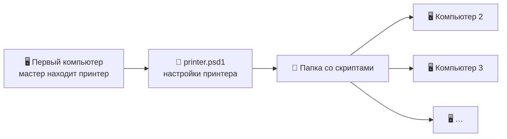

<div align="center">


**Принтер по Wi-Fi «думает» перед каждой печатью, а по кабелю печатает мгновенно?**<br>
Чаще всего виноват не Wi-Fi, а то, как Windows ищет принтер в сети. Скрипт исправляет это за один запуск.

[Быстрый старт](#-быстрый-старт) ·
[В чём проблема](#-в-чём-проблема) ·
[Что тронет, а что нет](#-что-скрипт-тронет-а-что-нет) ·
[Ключи](#-ключи) ·
[Сторож](#-сторож-если-ip-не-закреплён) ·
[Что проверено](#-что-проверено)

<table>
<tr>
<td align="center" width="33%">⚡<br><b>Один запуск</b><br><sub>Мастер сам находит принтер, его адрес, MAC и драйвер</sub></td>
<td align="center" width="33%">🎯<br><b>Только своё</b><br><sub>Меняет лишь сетевые очереди выбранного принтера</sub></td>
<td align="center" width="33%">🔙<br><b>Откат одной командой</b><br><sub>Перед изменениями — резервная копия всех принтеров</sub></td>
</tr>
</table>

</div>

## 🔍 В чём проблема


Типичная причина задержек — порт очереди указывает на **сетевое имя** принтера, которого не знает ни роутер, ни DNS. Перед каждым заданием Windows ищет принтер широковещательными запросами (LLMNR, mDNS). Это секунды, а когда ответ по Wi-Fi теряется, задание падает и спулер повторяет его через минуты.

Вторая частая причина — очередь через WSD со стандартным драйвером Microsoft вместо драйвера производителя. А поверх этого Windows любит плодить копии: «Принтер 0001», «Принтер 0002», отдельная WSD-очередь.

**Лекарство одно:** одна очередь с драйвером производителя на прямом порту `IP_<адрес>` (RAW 9100, без SNMP).

> Проект вырос из разбора одного офисного случая: МФУ Pantum печатал по Wi-Fi с ожиданием до 10 минут, а после перевода на IP-порт — сразу. Здесь то же решение, но без единого зашитого адреса или модели.

## 🚀 Быстрый старт

Скачайте [архив со скриптами](https://github.com/exuupery/printer-wifi-fix/archive/refs/heads/main.zip) (или **Code → Download ZIP**) и распакуйте в любую папку.

**На первом компьютере** — там, где принтер уже установлен и печатает, пусть и медленно:

1. Убедитесь, что установлен драйвер производителя принтера, а не только стандартный драйвер Microsoft.
2. Дважды щёлкните **`Fix-PrinterWiFi.cmd`**. Настроек ещё нет, поэтому запустится мастер: он найдёт сетевые принтеры на этом ПК и спросит, какой исправлять.
3. Мастер создаст рядом файл **`printer.psd1`** и предложит сразу исправить печать. Подтвердите запрос администратора (UAC), проверьте план и нажмите Enter.

**На остальных компьютерах** мастер уже не нужен: скопируйте папку целиком, вместе с `printer.psd1`, и дважды щёлкните `Fix-PrinterWiFi.cmd`.





Посмотреть план, ничего не меняя (права администратора не нужны):

```cmd
Fix-PrinterWiFi.cmd -WhatIf
```

> [!IMPORTANT]
> Закрепите за принтером постоянный IP на роутере. Печать идёт на конкретный адрес: если роутер выдаст принтеру другой, она остановится. Нет доступа к роутеру — поставьте [сторожа](#-сторож-если-ip-не-закреплён).

## 🎯 Что скрипт тронет, а что нет


**Что делает на каждом компьютере:**

1. **Проверяет, что по IP отвечает именно этот принтер** — сверяет MAC-адрес.
2. **Находит сетевые очереди этого принтера** и показывает план: что оставить, что удалить, что не трогать и почему.
3. **Спрашивает подтверждение.**
4. **Делает резервную копию** всех принтеров, портов и драйверов (PrintBrm).
5. **Оставляет одну очередь** с драйвером производителя на прямом порту.
6. **Удаляет сетевые дубли** и брошенные порты; если дубль был принтером по умолчанию, им становится новая очередь.

Если всё уже настроено, скрипт так и скажет и ничего менять не будет.

**Чего не касается:**

- USB-очереди и виртуальные принтеры;
- подключения к общим принтерам других компьютеров (`\\сервер\принтер`);
- очереди **других устройств**, даже той же модели с тем же драйвером;
- очереди факса (убрать: `-RemoveFax`);
- **сетевой сканер**: если он есть в Windows, связанные с ним WSD-очереди остаются — Windows удаляет их только вместе со сканером (убрать всё равно: `-RemoveNetworkScanner`);
- сетевые очереди, которые не удалось уверенно отнести к этому принтеру, — о них скрипт предупредит;
- настройки самого принтера.

Все проверки выполняются до первого изменения. Если что-то не сходится, скрипт останавливается с сообщением «Ничего не изменено».

## 🧭 Как скрипт узнаёт свои очереди

Очередь считается очередью этого принтера, если выполняется хотя бы одно условие. Они проверяются по порядку:

| # | Признак | Пример |
|:-:|---|---|
| 1 | Имя очереди совпадает с `QueueName` | очередь, созданная прошлым запуском |
| 2 | Порт ведёт на IP принтера | порт TCP/IP или имя, которое резолвится в этот IP |
| 3 | Порт указывает на имя хоста принтера | тот самый «медленный» порт на имя |
| 4 | Адрес определился и он **другой** | это другое устройство — не трогаем, дальше не проверяем |
| 5 | Имя хоста принтера есть в названии очереди | WSD-очередь вида «ИМЯ-ХОСТА (модель)» |
| 6 | Имя очереди или драйвера подходит под `MatchPattern` | то, что вы указали вручную |

Для WSD-очередей адрес берётся из свойств сетевого устройства Windows. Если адрес определить не удалось и ни один признак не сработал, очередь остаётся на месте, а скрипт подскажет добавить её в `MatchPattern`.

## 🔧 Ключи

Любой ключ можно дописать после `Fix-PrinterWiFi.cmd`.

| Ключ | Что делает |
|---|---|
| `-Setup` | Только мастер: выбрать принтер и записать `printer.psd1` |
| `-WhatIf` | Показать план, ничего не меняя |
| `-Yes` | Не задавать вопросов, принимать ответы по умолчанию |
| `-RemoveFax` | Удалить и сетевые очереди факса этого принтера |
| `-RemoveNetworkScanner` | Удалить WSD-очереди, даже если вместе с ними пропадёт сетевой сканер |
| `-TestPage` | В конце напечатать пробную страницу |
| `-Config <файл>` | Другой файл настроек, например для второго принтера |

<details>
<summary><b>Переопределение настроек и коды возврата</b></summary>

<br>

Параметры командной строки важнее значений из файла настроек: `-PrinterIP`, `-PrinterMac`, `-PrinterHostName`, `-DriverName`, `-QueueName`, `-MatchPattern`, `-PortNumber`.

| Код | Значение |
|:-:|---|
| `0` | готово |
| `1` | ошибка |
| `99` | скрипт перезапущен с правами администратора в новом окне |

</details>

## 📝 Файл настроек

`printer.psd1` — обычный текстовый файл, его можно править в Блокноте. Образец лежит в [`printer.example.psd1`](printer.example.psd1):

```powershell
@{
    PrinterIP       = '192.168.1.50'            # адрес принтера
    PrinterMac      = 'AA-BB-CC-DD-EE-FF'       # пусто - проверка «это точно он» пропускается
    PrinterHostName = 'PRINTER-123ABC'          # необязательно
    DriverName      = 'Имя драйвера производителя'
    QueueName       = 'Офисный принтер (Wi-Fi)' # одинаковое на всех компьютерах
    MatchPattern    = ''                        # regex для очередей, которые скрипт не опознал сам
    PortNumber      = 9100
}
```

> [!WARNING]
> `printer.psd1` описывает вашу сеть: IP и MAC принтера. В `.gitignore` он уже исключён — не публикуйте его.

## 🐕 Сторож, если IP не закреплён

```powershell
powershell -ExecutionPolicy Bypass -File .\Printer-Watchdog.ps1 -Install
```

Задача планировщика от имени системы: при старте Windows и каждые 15 минут, без окон. Если принтер перестал отвечать по своему адресу, сторож ищет его по MAC (ARP-кэш, mDNS, затем пинг подсети /24) и переводит очередь на новый порт. Настройки берёт из того же `printer.psd1`; для него обязателен `PrinterMac`.

| Запуск | Что делает |
|---|---|
| `-Install` | Поставить задачу (у каждой очереди своя) |
| `-Uninstall` | Убрать задачу |
| без ключей | Разовая проверка с выводом на экран |

Лог: `C:\ProgramData\PrinterWiFiFix\watchdog.log`.

## 🔙 Откат

Резервная копия и лог каждого запуска лежат в `C:\ProgramData\PrinterWiFiFix`. Готовая команда отката печатается при запуске и сохраняется в логе:

```powershell
& "$env:WINDIR\System32\spool\tools\PrintBrm.exe" -R -F "<файл .printerExport>"
```

## 🧪 Что проверено

Проект новый, поэтому честно о статусе.

| ✅ Проверено | ⏳ Ещё не проверено на практике |
|---|---|
| Мастер и пробный прогон `-WhatIf` на реальном ПК с сетевым МФУ Pantum | Боевой запуск с реальными изменениями именно этой версией (логика шагов унаследована от версии для Pantum, которая отработала) |
| Разбор очередей на смоделированном «захламлённом» ПК: дубли на имени хоста, WSD-очередь со сканером, факс, второй принтер той же модели, общий принтер | Определение адреса WSD-очередей на настоящих WSD-устройствах — пока только на модели |
| Сообщения об ошибках: неверный MAC, нет драйвера, занятое имя очереди, неинтерактивный запуск | Принтеры других производителей |
| Разовая проверка сторожа; передача параметров при повышении прав | Установка сторожа и его реакция на смену IP |

Перед первым запуском на новом принтере посмотрите план через `-WhatIf`.

## 📁 Что в папке

| Файл | Зачем |
|---|---|
| `Fix-PrinterWiFi.cmd` | Запуск двойным щелчком |
| `Fix-PrinterWiFi.ps1` | Мастер настройки и исправление очередей |
| `Printer-Watchdog.ps1` | Страховка на случай смены IP |
| `printer.example.psd1` | Образец файла настроек |
| `printer.psd1` | Ваши настройки; создаётся мастером, в репозиторий не попадает |
| `assets/` | Анимированные иллюстрации для этой страницы |
| `CONTRIBUTING.md` | Как устроен проект и что учесть при доработке |
| `LICENSE` | Лицензия MIT |

## 📄 Лицензия

[MIT](LICENSE). Скрипты распространяются «как есть», без гарантий: перед первым запуском посмотрите план через `-WhatIf`.

---

<div align="center">

<sub>Windows PowerShell 5.1 · без зависимостей и установки · всё работает из одной папки</sub>

</div>
